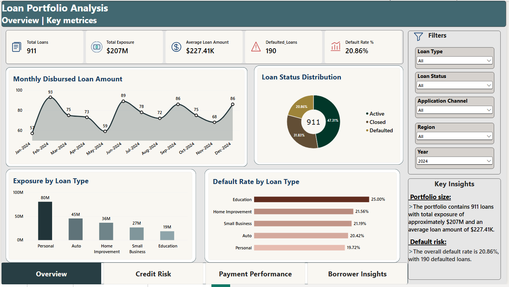
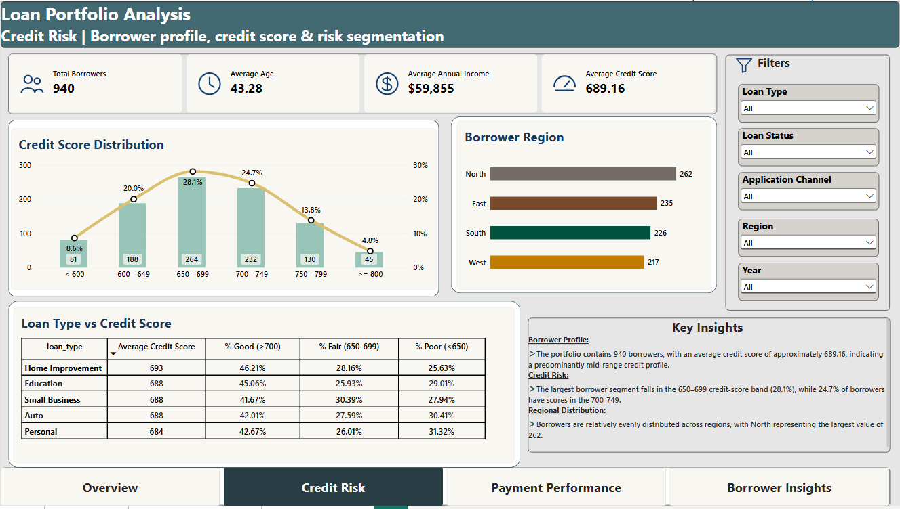
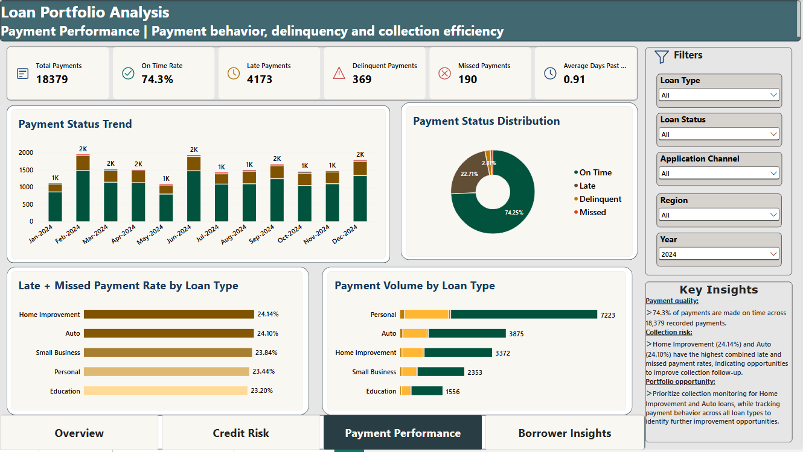
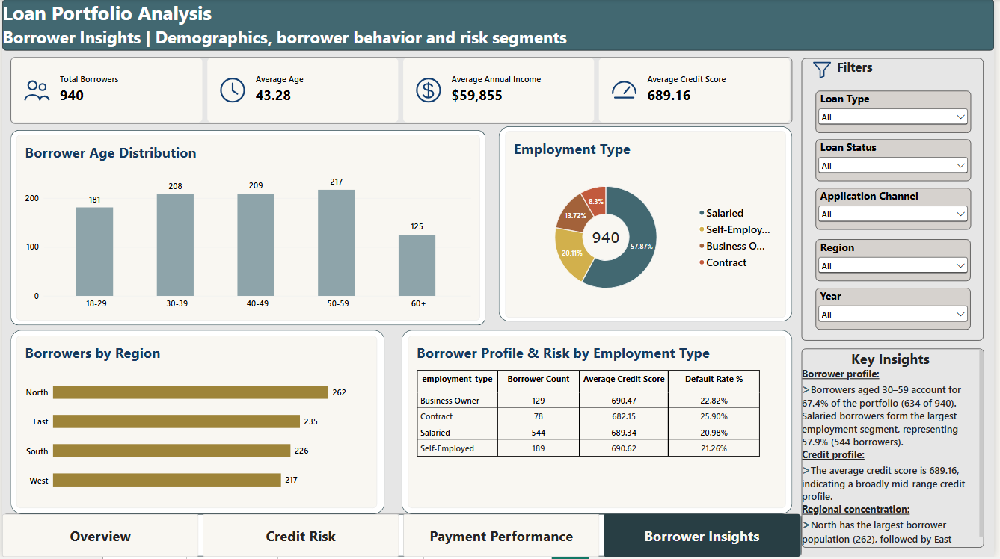

# Bank Loan & Credit Risk Analytics

An end-to-end analytics project exploring loan portfolio performance, borrower profiles, credit risk indicators, and repayment behavior using Excel, MySQL, Python (Pandas), and Power BI.

## Project Overview

This project analyzes five related datasets—borrowers, loans, loan payments, credit history, and collateral—to examine loan exposure, default patterns, credit score segments, payment performance, and borrower risk indicators. The work combines data validation, analytical SQL queries, Pandas-based exploratory analysis, Excel reporting, and an interactive Power BI dashboard.

## Business Problem

A loan portfolio needs to be monitored across exposure, loan status, repayment behavior, and borrower characteristics. This project uses historical portfolio data to summarize key indicators and highlight segments that may warrant further investigation. The analysis is exploratory and does not represent a lending decision or a validated predictive credit-scoring model.

## Business Questions

- What are the total loan count, total loan amount, average loan amount, and loan-status distribution?
- How does monthly disbursed loan amount change over time?
- Which loan types have the highest exposure and default rates?
- How do default rates and exposure vary across borrower credit-score bands?
- Which borrowers account for the highest total loan exposure?
- How do on-time, late, delinquent, and missed payments vary across the portfolio?
- Which loan types have higher late/missed payment rates?
- How do borrower region, employment type, application channel, income, debt, and credit utilization relate to portfolio risk indicators?
- Which active loans have recent payment problems or meet the project's defined risk-profile conditions?
- How concentrated is total exposure among the borrowers with the largest exposures?

## Tools & Technologies

- **Microsoft Excel** — workbook-based analysis, summary tables, dashboard calculations, borrower segmentation, repayment behavior, credit-score analysis, and risk summaries.
- **MySQL** — joins, aggregations, CTEs, window functions, ranking, monthly trends, loan exposure, default analysis, payment analysis, and borrower risk-condition queries.
- **Python** — Pandas for data inspection, validation, cleaning, feature creation, KPI analysis, segment comparisons, cohort analysis, and exploratory analysis.
- **Power BI** — interactive report pages for portfolio overview, credit risk, payment performance, and borrower insights.

## Datasets

The project uses five datasets:

| Dataset | Description |
|---|---|
| `Borrowers` | Borrower profile, income, debt, credit score, employment type, and region |
| `Loans` | Loan amount, loan type, loan status, application/disbursement dates, interest rate, and related loan attributes |
| `Loan_Payments` | Scheduled payment records, payment status, dates, and days past due |
| `Credit_History` | Borrower credit-history indicators, including credit utilization |
| `Collateral` | Collateral records associated with loans |

## Analysis Workflow

### 1. Data validation and preparation

The Pandas notebook checks dataset shapes and columns, data types, missing values, duplicate records and keys, categorical consistency, date validity, numeric ranges, and relationships between borrowers, loans, payments, and collateral. It also creates cleaned fields and analysis features where appropriate.

### 2. Excel analysis

The Excel workbook contains an Excel dashboard and supporting analysis sheets, including monthly trends, default summaries, repayment metrics, loan-type and application-channel summaries, credit-score analysis, borrower segmentation, income/debt risk, repayment behavior, and collateral coverage.

### 3. SQL analysis

The SQL script contains business queries covering:

- Loan totals, average loan amount, status counts, and loan-level default rate
- Monthly loan count and disbursed amount, including month-over-month change
- Loan-type exposure, default counts, and default rates
- Credit-score band comparisons
- Loan types with average loan amount and default rate above portfolio averages
- Borrower-level exposure and payment summaries
- Late/missed payment rate by loan type
- Defaulted exposure as a share of total exposure
- Disbursement-month default cohorts
- Latest payment status for each loan
- Borrower risk-condition flags based on project-defined thresholds
- Loan ranking, single-loan versus multiple-loan comparisons, and repeated non-on-time payment streaks
- Application-channel and regional comparisons
- Credit-utilization bands, active-loan follow-up conditions, and exposure concentration among the top 10% of borrowers

### 4. Python / Pandas analysis

The notebook includes:

- Dataset shape, column, and data-type inspection
- Missing-value, duplicate, primary-key, and categorical-quality checks
- Date validation and numeric quality checks
- Cleaning of categorical fields and date conversion
- Creation of debt-to-income, income-band, and credit-utilization features
- Portfolio KPI and loan-status summaries
- Monthly trends and month-over-month comparisons
- Segment analysis by credit score, employment type, region, loan type, and application channel
- Payment-status proportions and average days past due
- Default comparisons, correlation review, and outlier review
- Disbursement-cohort default analysis
- Visualizations for monthly loan exposure, default rate by credit-score band, exposure by loan type, payment status, and credit utilization versus default rate

## Power BI Dashboard Preview

The Power BI report contains four pages. The screenshots below are expected to be stored in the repository's `screenshots/` folder using these exact filenames.

### 1. Loan Portfolio Overview

Shows total loans, total exposure, average loan amount, defaulted loans, default rate, monthly disbursement, loan status distribution, exposure by loan type, and default rate by loan type.



### 2. Credit Risk

Shows credit-score distribution, borrower region, and loan-type comparisons across credit-score groups.



### 3. Payment Performance

Shows payment totals, on-time rate, late and delinquent payments, missed payments, monthly payment-status trends, payment-status distribution, late/missed rates by loan type, and payment volume by loan type.



### 4. Borrower Insights

Shows borrower count, average age, average annual income, average credit score, age distribution, employment type, regional distribution, and borrower profile/risk metrics by employment type.



## Key Dashboard Metrics

The following values are visible in the supplied Power BI screenshots with the dashboard filters shown:

- **Loan portfolio overview:** 911 loans, approximately **$207M** total exposure, **$227.41K** average loan amount, 190 defaulted loans, and a **20.86%** displayed default rate.
- **Borrower profile:** 940 borrowers, average age **43.28**, average annual income **$59,855**, and average credit score **689.16**.
- **Credit score distribution:** the 650–699 band represents **28.1%** of borrowers; the 700–749 band represents **24.7%**.
- **Payment performance:** 18,379 payments and a displayed on-time rate of **74.3%**; the page also shows 4,173 late payments, 369 delinquent payments, and 190 missed payments.
- **Late and missed payment rate by loan type:** Home Improvement is shown at **24.14%** and Auto at **24.10%**.

These are dashboard-display values, not independently reconciled figures. They may change with filter selections and should be validated against the final cleaned data and measure definitions before being presented as formal business results.

## Repository Structure

```text
bank-loan-credit-risk-analytics/
├── data/          # Project datasets
├── excel/         # Excel workbook and documentation
├── sql/           # SQL scripts and documentation
├── python/        # Pandas notebook and documentation
├── powerbi/       # Power BI report and documentation
├── screenshots/   # Dashboard screenshots
└── README.md      # Project documentation
```

## Skills Demonstrated

- Data quality assessment and validation
- Data cleaning and transformation with Pandas
- SQL joins, CTEs, aggregations, and window functions
- Loan portfolio and repayment analysis
- Credit-score and borrower-segment analysis
- KPI reporting and dashboard design
- Translating analytical questions into business-focused outputs

## Project Outcome

This project demonstrates an end-to-end data analytics workflow—from validating related datasets and querying portfolio metrics to exploratory analysis and dashboard reporting—with a focus on loan exposure, default indicators, borrower segments, and repayment performance.

*Portfolio project for learning and demonstration. Project-defined risk thresholds are analytical flags, not a validated credit decision model.*
